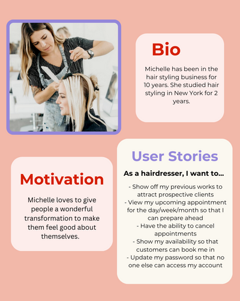
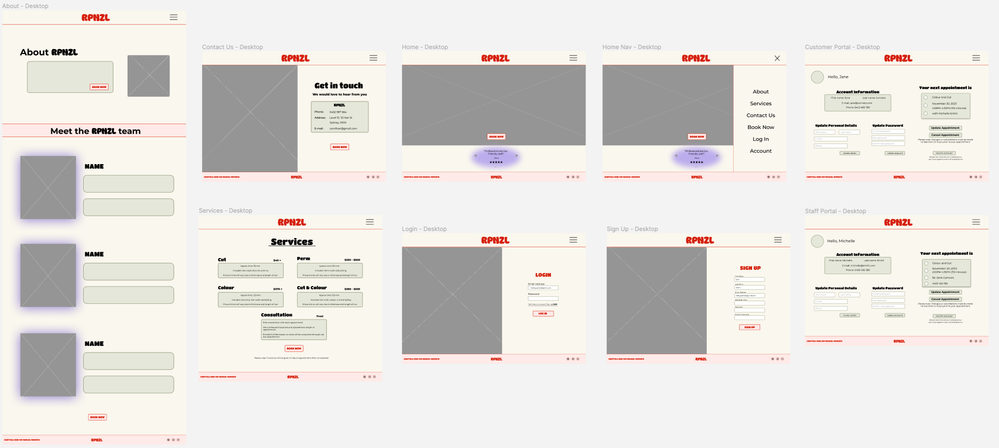
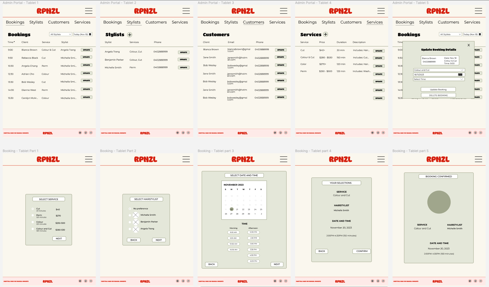
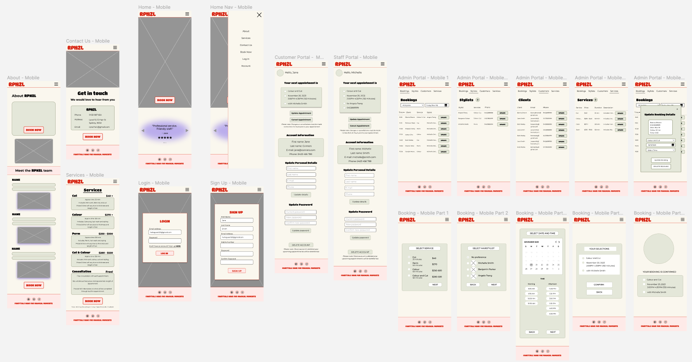
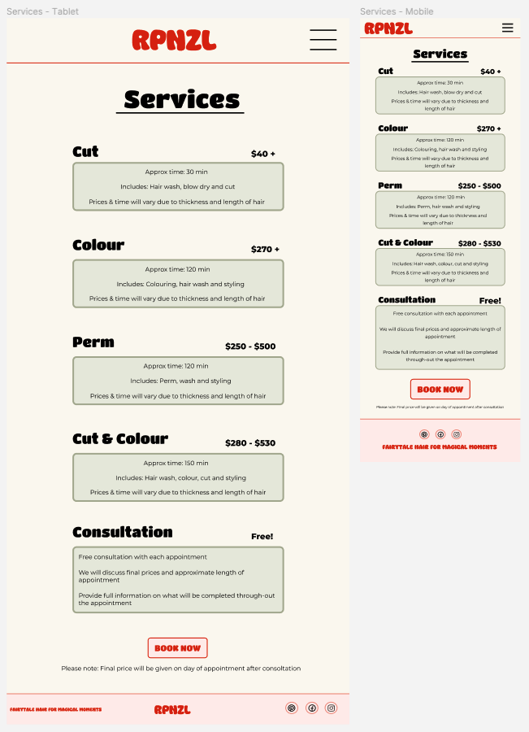
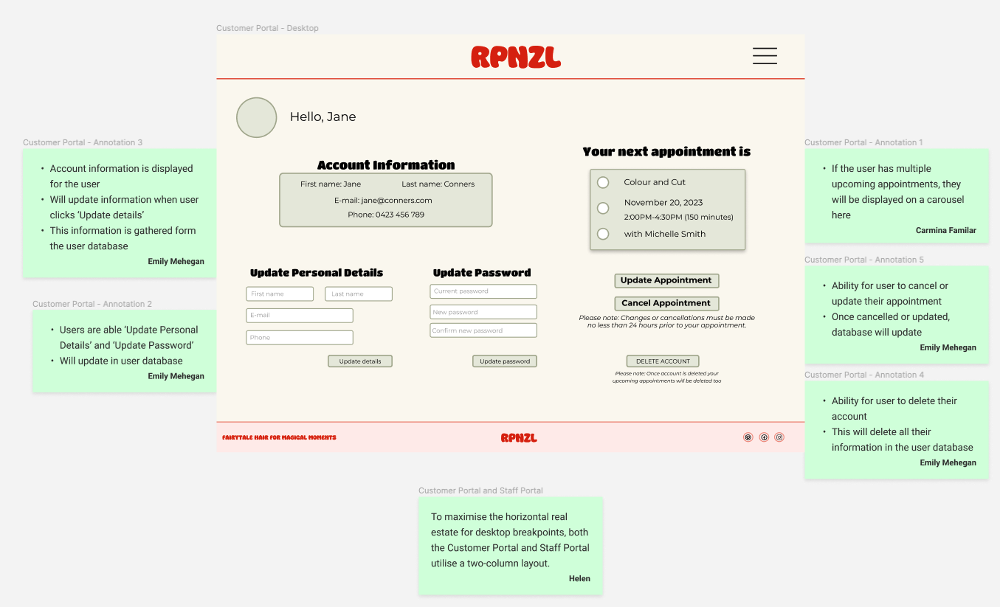
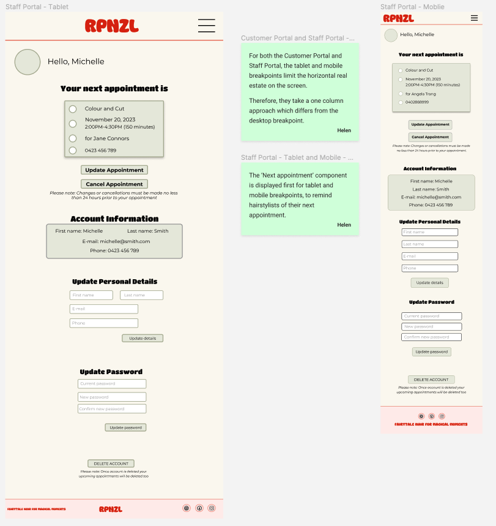

Developed by [Carmina](https://github.com/CarminaF), [Emily](https://github.com/e-mehegan), [Stephen](https://github.com/StevieG46) and [Helen](https://github.com/hotteok219) for Coder Academy T3A2 assignment.

# Links
http://rpnzl.studio/

### Deployed website

- Client: https://rpnzl.netlify.app/
- Server: https://ca-rpnzl-15265a6e99eb.herokuapp.com/

### GitHub repository

- Client: [rpnzl-client](https://github.com/CA-RPNZL/rpnzl-client)
- Server: [rpnzl-server](https://github.com/CA-RPNZL/rpnzl-server)
- Docs: [rpnzl-docs](https://github.com/CA-RPNZL/rpnzl-docs)

### Jump to:

- [Part A](#part-a)
- [Part B](#part-b)

# Part B

## Part B Table of contents

- [Libraries](#libraries)
- [Source control methodology](#source-control-methodology)
- [Project management methodology](#project-management-methodology)
- [Task delegation methodology](#task-delegation-methodology)
- [Testing](#testing)
    - [Formal testing](#formal-testing)
    - [Manual frontend testing: development and production](#manual-frontend-testing-development-and-production)
    - [Manual backend testing: development and production](#manual-backend-testing-development-and-production)
- [Screenshots](#part-b-screenshots)
- [Part A changes](#part-a-changes)

## Libraries

### Server

#### <u><b>[bcryptjs](https://www.npmjs.com/package/bcrypt)</u></b>

- Bcrypt hashes and salts passwords when being stored in the database to protect user accounts. It converts plaintext passwords into hashed strings. In the app, it is used for securing user passwords and user authorisation and authentication. 

#### <u><b>[cors](https://www.npmjs.com/package/cors)</u></b> 

- Cross-Origin Resource Sharing (CORS) is a middleware used for integrating applications. It enables the interaction between domains, which is completed through a HTTP-header based mechanism. This allows the server to specify domains other than its own that are permitted to interact. 

#### <u><b>[express](https://www.npmjs.com/package/express)</u></b>

- Is a Node.js framework that is flexible and streamlines the development of React web applications. it also provides a set of features and tools for applications. In the app, it aids through simplifying server creation and handles requests, routes and responses in the app. 

#### <u><b>[helmet](https://www.npmjs.com/package/helmet)</u></b>

- Is a collection of security middleware functions for Express.js that takes HTML tags and outputs plain HTML tags. In the app, it is used to add security and mitigate some common web vulnerabilities.  

#### <u><b>[dotenv](https://www.npmjs.com/package/dotenv)</u></b> 

- A Node.js module that manages environment variables from the .env file. In the app it is used on both the client-side and server-side to handle configuration settings and the securing of sensitive data such as database credentials and API keys. It also makes sure they are not saved to the source control system.

#### <u><b>[mongoose](https://www.npmjs.com/package/mongoose)</u></b>

- A Node.js Object Data Modeling (ODM) library that is used for MongoDB. It provides a variety of features such as schema-based solutions for modeling to make it easier to work and interact with MongoDB. For the app, we used Mongoose to create queries for creating, reading, updating and deleting data in the MongoDB database through HTTP methods.  

#### <u><b>[nodemon](https://www.npmjs.com/package/nodemon)</u></b>

- Tool used in Node.js which monitors changes in the source code to automatically restart the server when changes are detected. In the app, this has aided in streamlining the development process through avoiding manual server restarts for a more efficient workflow.  

#### <u><b>[jsonwebtoken](https://www.npmjs.com/package/jsonwebtoken)</u></b>

- A library used for the creation and verification of JSON Web Tokens (JWTs). It creates and manages JWTs, which in the app, are used to transmit admin and user data between the backend and frontend as a JSON object. This is used to authenticate the admin and user profiles and authorises the profiles for specific actions. For example, only the admin will be able to update, delete and add services, whereas a user will be able to view services.   

 

### Client 

#### <u><b>[axios](https://www.npmjs.com/package/axios)</u></b>  

- A promise-based HTTP client for both the browser and node.js. It’s able to run in node.js and the browser with the same codebase. For client-side it uses XHLHttpRequests and server-side uses the native node.js http module. For the app, it is used to make HTTP requests to external APIs and handle the responses.

#### <u><b>[react-bootstrap](https://www.npmjs.com/package/react-bootstrap)</u></b> 

- CSS framework that is easy to integrate into a React application for enhanced design and functionality. In the app, it is used for various components to aid in the functionality of the application. 

#### <u><b>[react-router-dom](https://www.npmjs.com/package/react-router-dom )</u></b>

- Library for routing in the front-end. In the app, it provides a way to define the front-end routes to ensure that users are navigated to the right page when clicking links, buttons and forms. 

#### <b><u>[font-awesome](https://fontawesome.com/)</b></u>

- An icon and font library. This is used through-out the app for various icons. 

#### <u><b>[react-toastify](https://www.npmjs.com/package/react-toastify)</u></b>

- Is a component for pop-up notifications in React apps. In the app, it is used for providing error, warning or success notifications when using the app. This is present on the ‘Sign-up’ and ‘User-Portal’. 

#### <u><b>[react-responsive-carousel](https://www.npmjs.com/package/react-responsive-carousel)</u></b>

- Is a component for building carousels in React. In the app, it is used for both image carousels on the ‘About’ page and for reviews on the ‘Home’ page. 

#### <u><b>[react-loader-spinner](https://www.npmjs.com/package/react-loader-spinner)</u></b> 

- Is a component used for async await operations before the data has been loaded onto the screen. In the app, this is used to provide the user with a loading screen and indicate that their request is being processed. 

#### <u><b>[react-dateslot-picker](https://www.npmjs.com/package/react-dateslot-picker)</u></b> 

- Component used for the booking process for the user to select a time slot for their appointments. A user is able to select a date from the calendar then their desired timeslot to reserve the booking.

 

### Testing

#### <u><b>[Jest](https://jestjs.io/)</u></b> 

- JavaScript testing framework that supports a variety of tests that include snapshot testing and asynchronous testing. Jest is used to write and test unit and integration tests to ensure the functionality of the application. 

#### <u><b>[@testing-library/jest-dom](https://www.npmjs.com/package/@testing-library/jest-dom) & @testing-library/react</u></b> 

- Dependencies relating to the Jest testing framework which provides testing tools for React component testing. 

#### <u><b>[@babel/preset-env, babel-jest & @babel/preset-react](https://babeljs.io/docs/presets)</u></b>

- Babel dependencies that advance babel capabilities by supporting transformations of React JSX syntax and ensuring Jest works with Babel.

#### <u><b>[Supertest](https://www.npmjs.com/package/supertest)</u></b>

- Is used for testing on the server-side of the application ensuring that it is functional. It works in conjunction with Jest and is used for testing endpoints through simulating HTTP requests and their responses.

## Source control methodology

In our collaborative effort in building RPNZL, source control utilised was the industry standard Git. The client and server-side git repositories were both set up on GitHub under a GitHub organisation. Each repository initially had a dev and main branch and feature branches were then branched off of dev.

- Feature branches allowed for parallel development where our developers are able to work on a feature in isolation.
- The main branch is the stable branch used for deploying to production.
- The dev branch is used for the integration of features. Dev was then merged to main at the end of each week.

Frequent communication and code reviews were crucial in maintaining code quality and consistency with at least one person reviewing each pull request from the feature branch to dev. Synchronising when to push code to dev and pulling latest changes from dev to the feature branch ensures minimal merge conflicts.

Regular commits were also made and commit messages were in the following form: “feat: \<feature worked on\>” or “fix: \<bug that was fixed\>” to illustrate work done on each commit. Pull requests were utilised for code review and once completed, the link to the pull requests were added to their corresponding Trello card.

*Please refer to the [Screenshots](#part-b-screenshots) section for additional screenshots.*

*[^ Jump to Part B Table of contents](#part-b-table-of-contents)*

## Project management methodology

### Project management board

For Part B, we continued using the Trello board to manage our tasks: [https://trello.com/b/Jz9YZmmt/rpnzl](https://trello.com/b/Jz9YZmmt/rpnzl)

We followed the same Trello board guidelines as outlined in [Part A](#trello-board-guidelines).

The only major change was the introduction of two extra columns (**Done - Sprint 1** and **Done - Sprint 2**). Instead of archiving cards once a sprint was finished, we decided to separate cards that were completed in each sprint. This provides visibility for assignment purposes, but also allows us to visually celebrate all that we have accomplished at the end of a sprint.

### Sprints and stand ups

Our sprints remained as two week blocks, as planned in Part A.
- **Sprint 1** - Sunday 12 November - Saturday 25 November
Sprint planning meeting: Sunday 12 November @ 7:00pm ACDT / 7:30pm AEDT
    - **Week 1** - Discussed each requirement of Part A as a team. This covered what should be included for each requirement, as well as any ideas or rough sketches.
    - **Week 2** - Drafted the content / diagrams as per the requirements and began the review process.
- **Sprint 2** - Sunday 26 November - Saturday 9 December
Sprint planning meeting: Monday 27 November @ 7:00pm ACDT / 7:30pm AEDT
    - **Week 1** - This was week 3 for Part A. Finalised the content / diagrams, addressed feedback and made continuous improvements. After all requirements were completed, everything was collated and sent to each team member for approval. Once approved, Part A was submitted for marking.
    - **Week 2** - This was week 1 for Part B. Prepared the foundations of our web application. This included getting our deployment servers and MongoDB Cloud set up, as well as creating static pages (client side), models and controllers (server side).
- **Sprint 3** - Sunday 10 December - Sunday 23 December
Sprint planning meeting: Sunday 10 December @ 7:00pm ACDT / 7:30pm AEDT
    - **Week 1** - We spent week 1 focusing on pulling data in dynamically and getting the functionality up and running. This also involved researching and implementing appropriate packages.
    - **Week 2** - Week 2 was a wrap up on the build, finalising functionality, cleaning up code comments and bugs, as well as trying to make the code more DRY. Testing and documentation was also completed in week 2. Once reviewed, the project was collated and sent to each team member for approval. Once approved, Part B was submitted for marking.

During our sprint planning meetings, we would discuss:
- what tasks needed to be completed,
- the priority / order of tasks,
- task allocation,
- the high level approach,
- ideal timelines and
- the review process.

After each sprint planning meeting, cards were created on Trello.

The team also took an agile approach, to accommodate any learnings and experiences we encounter.

Examples include:

- Due dates could be pushed if we found something more challenging than originally scoped.
- Additional tasks were created, and reprioritised, if there was something we didn’t account for during planning.

We continued our daily standups at 6:30pm ACDT / 7pm AEDT, Monday to Friday. On Saturdays and Sundays, there were several ad hoc meetings whenever we needed assistance, or felt like it was beneficial to regroup.

We also continued to take meeting notes to accommodate for any absences, as well as communicated freely via Discord.

During Part A, our standups were longer with more discussion around planning. For Part B, we kept the standups short and addressed the questions below:

- What did you achieve today?
- What’s the plan for the rest of the day?
- Do you have any road blockers?

Additionally, we spent some time going over any ‘other notes or questions’ - such as reminders and discussing Discord standup questions.

*Please refer to the [Screenshots](#part-b-screenshots) section for additional screenshots and [Part A - R6 Project management](#r6-project-management).*

*[^ Jump to Part B Table of contents](#part-b-table-of-contents)*

## Task delegation methodology

In the orchestration of task delegation, our team implemented an effective Kanban board system, showcasing an exemplary balance between acknowledging team members' strengths and addressing their weaknesses in alignment with the project's requirements. This meticulous approach was evident in our use of a Kanban board that featured tickets thoughtfully and collaboratively assigned to team members. Enhancing our management capabilities, Trello was our primary tool for task delegation and tracking.

Leveraging Trello's features, we employed tags to signify the sprint phase, complexity level (ranging from simple to complex which was subjective to each team member), assignment of team members, Git commits and deadlines for each task. This visual representation (see screenshots below for reference), allowed for a comprehensive overview of the project's status and individual responsibilities. Simultaneously, Discord served as our main hub for communication and collaboration, seamlessly integrated with the Trello board. This dual-channel approach fostered a dynamic and efficient communication structure, ensuring that the team remained well-connected and well-informed throughout the project's lifecycle.

The team's strategic approach to task delegation extended beyond just the assigned tasks, as it took into account the individual strengths and weaknesses of each team member. Initially, Carmina and Emily, leveraging their strengths in HTML, CSS and UI, collaborated on the frontend, focusing on UI and page design. Meanwhile, Steve and Helen, feeling proficient in backend technologies, concentrated on the backend, setting up models, schemas, and controllers. This division of tasks allowed for a harmonious blend of expertise and ensured that each team member contributed optimally to their respective domains. Furthermore, the team maintained an agile mindset, readily adapting to unforeseen challenges by advising early if someone felt uncomfortable in their assigned role, fostering an environment of mutual support and continuous improvement

Administratively we took turns in replying to the Stand-Ups requested by Alex on Discord, taking screenshots of our Trello board to track progress, along with merging our Dev branch to our Main for both our Client and Server repos.

During Part A we discussed everything as a group, developed and produced the content and then had the whole team review before finalising the item. This was completed as a Google doc collaboratively before transitioning it to a markdown file. Whereas in Part B of this assignment, as stated above, we split into a backend and frontend team. Each individual then took on a page to start developing. Once ready, a request for review would be sent to one other team member, before moving on to the next task. The team used our daily stand-ups to navigate progress and held a sprint planning meeting every 2nd week to discuss major successes, developments and plans to reach our end goal.

*Please refer to the below screenshots, as well as the [Screenshots](#part-b-screenshots) section for additional screenshots.*

*[^ Jump to Part B Table of contents](#part-b-table-of-contents)*

## Testing

### Manual frontend testing: development and production

Google Drive: [RPNZL Manual testing](https://docs.google.com/spreadsheets/d/1kG-xux3s5kOLra6acnPa56jL2x_x2DT9kG-ofwZRCmk/edit?usp=sharing)

### Manual backend testing: development and production

- [Users](#manual-testing-users)
- [Services](#manual-testing-services)
- [Appointments](#manual-testing-appointments)

#### Users

##### Log in (User: hairstylist, admin or client)
    - Development URL: http://localhost:3000/login
    - Production URL: https://ca-rpnzl-15265a6e99eb.herokuapp.com/login
    - HTTP Method: POST
    - Expected output: JWT, userId, isAdmin, isHairstylist
    - Result: PASS

.png)

.png)

##### Sign up
    - Development URL: http://localhost:3000/users 
    - Production URL: https://ca-rpnzl-15265a6e99eb.herokuapp.com/users
    - HTTP Method: POST
    - Expected output: User details
    - Result: PASS

##### Update personal details
    - Development URL: http://localhost:3000/users/id/:id
    - Production URL: https://ca-rpnzl-15265a6e99eb.herokuapp.com/users/id/:id
    - HTTP Method: PATCH
    - Expected output: User’s updated details
    - Result: PASS

##### Update password
    - Development URL: http://localhost:3000/change-password/:id
    - Production URL: https://ca-rpnzl-15265a6e99eb.herokuapp.com/change-password/:id
    - HTTP Method: PATCH
    - Expected output: “Successfully change password”, able to login
    - Result: PASS

##### Delete user
    - Development URL: http://localhost:3000/users/id/:id
    - Production URL: https://ca-rpnzl-15265a6e99eb.herokuapp.com/users/id/:id
    - HTTP Method: DELETE
    - Expected output: “User account and future appointments deleted successfully.” + deleted users’ details
    - Result: PASS

##### All users (admin)
    - Development URL: http://localhost:3000/users
    - Production URL: https://ca-rpnzl-15265a6e99eb.herokuapp.com/users
    - HTTP Method: GET
    - Expected output: 
    - Result: PASS

.png)

.png)

##### Get user (self)
    - Development URL: http://localhost:3000/users/id/:id
    - Production URL: https://ca-rpnzl-15265a6e99eb.herokuapp.com/users/id/:id
    - HTTP Method: GET
    - Expected output: User’s details
    - Result: PASS

.png)

.png)

#### Services

##### All services
    - Development URL: http://localhost:3000/services
    - Production URL: https://ca-rpnzl-15265a6e99eb.herokuapp.com/services
    - HTTP Method: GET
    - Expected output: All services
    - Result: PASS

#### Appointments

##### Get appointments for client
    - Development URL: http://localhost:3000/appointments/user/:userId?pastAppt=false
    - Production URL: https://ca-rpnzl-15265a6e99eb.herokuapp.com/appointments/user/:userId?pastAppt=false
    - HTTP Method: GET
    - Expected output: All future appointments for a client
    - Result: PASS

##### Get appointments for hairstylists

    - Development URL: http://localhost:3000/appointments/hairstylist/:userid?pastAppt=false
    - Production URL: https://ca-rpnzl-15265a6e99eb.herokuapp.com/appointments/hairstylist/:userid?pastAppt=false
    - HTTP Method: GET
    - Expected output: All future appointments where the user is the hairstylist
    - Result: PASS

##### Get a single appointment

    - Development URL: http://localhost:3000/appointments/id/:apptId
    - Production URL: https://ca-rpnzl-15265a6e99eb.herokuapp.com/appointments/id/:apptId
    - HTTP Method: GET
    - Expected output: All details for one appointment
    - Result: PASS

##### Delete an appointment

    - Development URL: http://localhost:3000/appointments/id/:apptId
    - Production URL: https://ca-rpnzl-15265a6e99eb.herokuapp.com/appointments/id/:apptId
    - HTTP Method: DELETE
    - Expected output: Details of the deleted appointment
    - Result: PASS

##### Book an appointment

    - Development URL: http://localhost:3000/appointments
    - Production URL: https://ca-rpnzl-15265a6e99eb.herokuapp.com/appointments
    - HTTP Method: POST
    - Expected output: Details of the new appointment
    - Result: PASS

##### Update an appointment

    - Development URL: http://localhost:3000/appointments/id/:apptId
    - Production URL: https://ca-rpnzl-15265a6e99eb.herokuapp.com/appointments/id/:id
    - HTTP Method: PATCH
    - Expected output: Details of the updated appointment
    - Result: PASS

*[^ Jump to Part B Table of contents](#part-b-table-of-contents)*

##  Screenshots

### Start of Part B Week 1 / end of Sprint 2 - 10 December 2023

### Part B Week 2 / start of Sprint 3 - 17 December 2023

### End of Part B Week 3 / end of Sprint 3 - 24 December 2023

*[^ Jump to Part B Table of contents](#part-b-table-of-contents)*

## Part A changes

- Changes to Admin Portal styling, which included having multiple buttons for CRUD operations, styling of modal/pop-up.
- Some styling changes to Booking confirmation.
- Added pop-up notifications to the website.
- Added a loader to the site for when different elements are being loaded by the website for a enhanced user experience.
- User portal and staff portal was combined into one, due to time constraints.
- Customers and stylists tab in Admin Portal was combined into one, due to time constraints.

*[^ Jump to Part B Table of contents](#part-b-table-of-contents)*

***

# Part A

## Part A Table of contents

- [R1 Description](#r1-description)
    - [Purpose](#purpose)
    - [Functionality / features](#functionality--features)
    - [Target audience](#target-audience)
    - [Tech stack](#tech-stack)
- [R2 Dataflow diagram](#r2-dataflow-diagram)
- [R3 Application architecture](#r3-application-architecture)
- [R4 User stories](#r4-user-stories)
    - [User personas and user stories](#user-personas-and-user-stories)
    - [Revision and refinement of user stories](#revision-and-refinement-of-user-stories)
- [R5 Wireframes](#r5-wireframes)
- [R6 Project management](#r6-project-management)
    - [Planning methodology](#planning-methodology)
    - [Screenshots](#part-a-screenshots)

## R1 Description

### Purpose

We are developing a full-stack web application tailored for the hair salon, RPNZL, which is transitioning into the online realm. Previously, RPNZL managed appointments using pen and paper. Customers were limited to in-person visits or phone calls to enquire about appointment times and availability.

The primary purpose of the app is to provide customers the ability to self-manage their appointments, as well as offering visibility to RPNZL’s salon manager and hairstylists. By moving the appointment system online, RPNZL hopes to increase their online presence, improve efficiency, reduce errors and provide customers with the convenience of 24/7 appointment scheduling.

### Functionality / features

The application features day and time slot options, along with diverse service selections. It guarantees a dynamic and personalised interaction for each user. Users can manage their appointments effortlessly, with the ability to easily cancel or reschedule their appointments.

To expand on user experience, the application will require customers and staff to register and log in. This is to ensure the privacy and safety of customer information through secure user authentication and authorisation. Staff such as the salon manager or hairstylists, have access to a staff only dashboard. Staff will also be able to manage their appointments.

The full-stack web application will create a user-friendly appointment scheduling process for customers at RPNZL but also provides hairstylists with a client management system. Features such as secure logins, intuitive booking, and easy appointment management, will provide an elevating salon experience for both clients and staff.

Pricing may vary due to thickness and length of hair, therefore payments will be made at the salon after the appointment.

#### Appointment management

Users can:
- choose their preferred service and hairstylist,
- view a hairstylist’s availability,
- select a suitable day and time slot,
- make an appointment,
- view appointments,
- reschedule an appointment, and
- cancel an appointment.

#### Account management

Users can:
- register for a customer account,
- log in and log out of their account,
- view appointment details that’s only relevant to the user
- customers can only see their appointments
- hairstylists can see appointments that have been booked with them
- update their account details, and
- update their password.

#### Administrator functions
Additionally, the salon manager (administrator) can:
- create new salon services
- update existing salon services,
- remove salon services,
- register hairstylists for a staff account, and
- view, create, update and delete any/all appointments.

#### General pages
Users can find information about:
- the salon, reviews and images,
- the hairstylists,
- the services available, and
- the salon’s contact details.

### Target audience

RPNZL’s application is designed to cater to the needs of the customers, hairstylists and the salon manager. 

For existing and prospective customers, the application provides a convenient, online hair appointment system. The application is hassle-free, secure and provides a range of services with relevant information.

For the hairstylists and salon manager, the application aims to streamline their daily appointments. They will benefit from personal logins which grant them access to a dedicated dashboard for efficient appointment management.

### Tech stack

#### Front end

- [React](https://react.dev/)
- [Bootstrap](https://getbootstrap.com/)

#### Back end

- [Express](https://expressjs.com/)
- [Node.js](https://nodejs.org/en)

#### Database

- [MongoDB](https://www.mongodb.com/)
- [Mongoose](https://mongoosejs.com/)

#### Testing

- [Jest](https://jestjs.io/)

#### Deployment and hosting

- [Netlify](https://www.netlify.com/)
- [Heroku](https://www.heroku.com/)
- [MongoDB Atlas](https://www.mongodb.com/atlas/database)

#### Source control

- [GitHub](https://github.com/)

*[^ Jump to Part A Table of contents](#part-a-table-of-contents)*

## R2 Dataflow diagram

Please open image in a new tab for better clarity.

*[^ Jump to Part A Table of contents](#part-a-table-of-contents)*

## R3 Application architecture

Please open image in a new tab for better clarity.

*[^ Jump to Part A Table of contents](#part-a-table-of-contents)*

## R4 User stories

### User personas and user stories

#### First time customer

#### Regular customer

#### Hairstylist

#### Salon manager

### Revision and refinement of user stories

- Originally the user persona referenced one type of customer. After initial research, we introduced 2 types of customers: a regular customer and a first-time customer. The first time customer might like services and features such as:
    - a hair consultation
    - photos of the hairstylist’s previous works.

  Therefore we introduced 2 new features to our system.
- Initially, the hairstylists could sign up for their own account. However, we realised there is nothing stopping the average person from making an account. Therefore, we changed it so only the salon manager can make a hairstylist's account.

*[^ Jump to Part A Table of contents](#part-a-table-of-contents)*

## R5 Wireframes

[Figma Link](https://www.figma.com/file/bYxlYHjWs7hUZ7zzUOx1P3/RPNZL?type=design&node-id=1%3A13&mode=design&t=BYAt8CUQpq7hQ34U-1)

### Process
- We initiated the design process by creating low-fidelity wireframes to visualize potential layouts for the website pages. Following the conceptualization phase, we had a meeting to collaboratively evaluate and select the most promising wireframe ideas for each page, arriving on the final layout.

  We progressed to the creation of coloured wireframes. Multiple colour palette options were generated, and as a team, we discussed the preferred colour scheme and font for the site. The selected choices were then applied to develop the coloured wireframes, which were further detailed through annotations on a separate page.

### Desktop

### Tablet

### Mobile

### Further screenshots of wireframes
Below are further screenshots of the wireframes including annotated wireframes that provide more detail.

  
Low Fidelity: Wireframe Ideas

  
### Home
#### Desktop

#### Mobile/Tablet

### Login
#### Desktop

#### Mobile/Tablet

### Sign Up
#### Desktop

#### Mobile/Tablet

### Services
#### Desktop

#### Mobile/Tablet

### Contact Us
#### Desktop

#### Mobile/Tablet

### About
#### Desktop

#### Mobile/Tablet

### Customer Portal
#### Desktop

#### Mobile/Tablet

### Staff Portal
#### Desktop

#### Mobile/Tablet

### Admin Portals
#### Desktop

#### Mobile/Tablet

### Booking Process Pages
#### Desktop

#### Mobile/Tablet

 

  
Final: Low Fidelity

#### Desktop

#### Tablet

#### Mobile

 

  
Coloured Wireframes: Annotated

### Home

#### Desktop

#### Mobile/Tablet

### Login

#### Desktop

#### Mobile/Tablet

### Sign Up

#### Desktop

#### Mobile/Tablet

### Services

#### Desktop

#### Mobile/Tablet

### Contact Us

#### Desktop

#### Mobile/Tablet

### About

#### Desktop

#### Mobile/Tablet

### Customer Portal

#### Desktop

#### Mobile/Tablet

### Staff Portal

#### Desktop

#### Mobile/Tablet

### Admin Portals

#### Desktop

#### Mobile/Tablet

### Booking Process Pages

#### Desktop

#### Mobile/Tablet

 

*[^ Jump to Part A Table of contents](#part-a-table-of-contents)*

## R6 Project management

### Planning methodology

For our project management board, we used Trello.

Trello board: [https://trello.com/b/Jz9YZmmt/rpnzl](https://trello.com/b/Jz9YZmmt/rpnzl)

### Sprints and stand ups

We set up our sprints to be two week blocks, with a sprint planning meeting at the start of the sprint.

- **Sprint 1** - Sunday 12 November - Saturday 25 November
    - Sprint planning meeting: Sunday 12 November @ 7:00pm ACDT / 7:30pm AEDT
- **Sprint 2** - Sunday 26 November - Saturday 9 December
    - Sprint planning meeting: Sunday 26 November @ 7:00pm ACDT / 7:30pm AEDT
- **Sprint 3** - Sunday 10 December - Sunday 23 December
    - Sprint planning meeting: Sunday 10 December @ 7:00pm ACDT / 7:30pm AEDT

For Sprint 1, we decided to have daily stand ups at 6:30pm ACDT / 7pm AEDT, Monday to Friday.

Saturdays and Sundays were open for optional, ad hoc meetings instead.

For each stand up, notes were taken to accommodate any absences for the day, which allowed team members to catch up.

For Sprint 2 and 3, we would reflect on Sprint 1 before making any decisions.

### Trello board guidelines

#### Column definitions

Our Trello board is divided into 5 columns:
- **Resources**
    - For easy access to the card template, Trello guidelines, Git guidelines and Sprint & stand ups.
- **To Do**
    - Cards sit here until they’re allocated a sprint.
    - Cards can, but do not need to be assigned to a team member in this column.
    - Cards can, but do not need a due date.
- **In Progress**
    - Cards move here when they’re in the current sprint and actively being worked on.
    - All cards in this column should have at least one assignee.
    - All cards in this column should have at least one sprint label.
    - All cards in this column should have a due date.
- **Review / Test**
    - Cards move here when they’re being reviewed or tested.
    - All cards in this column should have at least one assignee.
    - All cards in this column should have at least one sprint label.
    - All cards in this column should have a due date.
- **Done**
    - Cards move here when they’re completed (100%).
    - All cards in this column should have at least one assignee (members who actioned and members who reviewed).
    - All cards in this column should have at least one sprint label.
    - All cards in this column should have a due date.

#### Other guidelines

- Using the card template, select **Create card from template** to create a new card.
- Every card should have an assignee (unless it’s in **To do** / **Resources**).
- Every card should have a due date (unless it’s in **To do** / **Resources**).
- Every card should have a label indicating difficulty (**Simple** / **Challenging** / **Complex**).
- During sprint planning:
    - cards in **To do** should be allocated to a team member.
    - cards should be given the appropriate sprint label (**Sprint 1** / **Sprint 2** / **Sprint 3**).
    - cards should be moved to **In progress** when they're being worked on.
- If a card is not completed by the end of sprint, the card should be labelled with both the original and next sprint (e.g. a task was complex so it was labelled with **Sprint 2** and **Sprint 3**).
- In the card description, enter a summary of the task (if applicable).
- In the card description, enter the name of the primary lead on the feature and the reviewer.
- Use checklists feature.
- Comments:
    - Use comments to tag someone specific if you want to ask a question / ask for advice etc.
    - Use comments to track updates, adaptations or changes that are made.
    - Post related Git commit links when you merge to main.
    - Post other related links such as Diagram.io or Figma links.

*[^ Jump to Part A Table of contents](#part-a-table-of-contents)*

###  Screenshots

#### Start of Sprint 1 - 13 November 2023

#### Middle 1 of Sprint 1 - 17 November 2023

##### Screenshot 1 of 2

##### Screenshot 2 of 2 (‘Done’ column scrolled all the way down)

#### Middle 2 of Sprint 1 - 22 November 2023

#### End of Part A - 29 November 2023

##### Screenshot 1 of 2

##### Screenshot 2 of 2

*[^ Jump to Part A Table of contents](#part-a-table-of-contents)*