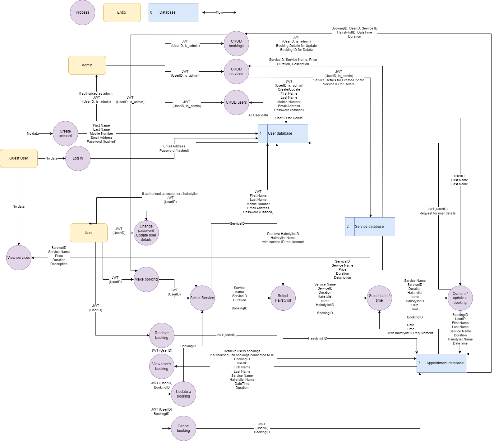
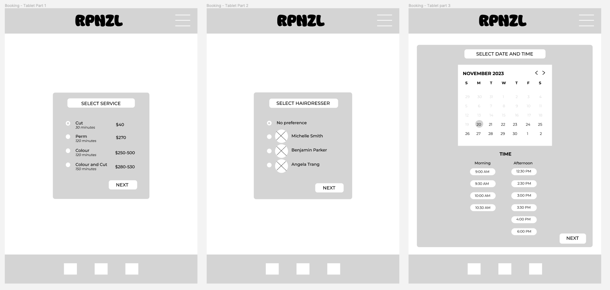

Developed by [Carmina](https://github.com/CarminaF), [Emily](https://github.com/e-mehegan), [Stephen](https://github.com/StevieG46) and [Helen](https://github.com/hotteok219) for Coder Academy T3A2 assignment.

# Links
http://rpnzl.studio/

### Deployed website

- Client: https://rpnzl.netlify.app/
- Server: https://ca-rpnzl-15265a6e99eb.herokuapp.com/

### GitHub repository

- Client: [rpnzl-client](https://github.com/CA-RPNZL/rpnzl-client)
- Server: [rpnzl-server](https://github.com/CA-RPNZL/rpnzl-server)
- Docs: [rpnzl-docs](https://github.com/CA-RPNZL/rpnzl-docs)

### Jump to:

- [Part A](#part-a)
- [Part B](#part-b)

# Part B

## Part B Table of contents

- [Libraries](#libraries)
- [Source control methodology](#source-control-methodology)
- [Project management methodology](#project-management-methodology)
- [Task delegation methodology](#task-delegation-methodology)
- [Testing](#testing)
    - [Formal testing](#formal-testing)
    - [Manual bfrontend testing: development and production](#manual-backend-testing-development-and-production)
    - [Manual backend testing: development and production](#manual-backend-testing-development-and-production)
- [Screenshots](#part-b-screenshots)

## Libraries

*[^ Jump to Part B Table of contents](#part-b-table-of-contents)*

## Source control methodology

*[^ Jump to Part B Table of contents](#part-b-table-of-contents)*

## Project management methodology

*[^ Jump to Part B Table of contents](#part-b-table-of-contents)*

## Task delegation methodology

*[^ Jump to Part B Table of contents](#part-b-table-of-contents)*

## Testing

### Manual backend testing: development and production

#### User

##### Log in (User: hairstylist, admin or client)
    - Development URL: http://localhost:3000/login
    - Production URL: https://ca-rpnzl-15265a6e99eb.herokuapp.com/login
    - HTTP Method: POST
    - Expected output: JWT, userId, isAdmin, isHairstylist
    - Result: PASS

.png)

.png)

##### Sign up
    - Development URL: http://localhost:3000/users 
    - Production URL: https://ca-rpnzl-15265a6e99eb.herokuapp.com/users
    - HTTP Method: POST
    - Expected output: User details
    - Result: PASS

##### Update personal details
    - Development URL: http://localhost:3000/users/id/:id
    - Production URL: https://ca-rpnzl-15265a6e99eb.herokuapp.com/users/id/:id
    - HTTP Method: PATCH
    - Expected output: User’s updated details
    - Result: PASS

##### Update password
    - Development URL: http://localhost:3000/change-password/:id
    - Production URL: https://ca-rpnzl-15265a6e99eb.herokuapp.com/change-password/:id
    - HTTP Method: PATCH
    - Expected output: “Successfully change password”, able to login
    - Result: PASS

##### Delete user
    - Development URL: http://localhost:3000/users/id/:id
    - Production URL: https://ca-rpnzl-15265a6e99eb.herokuapp.com/users/id/:id
    - HTTP Method: DELETE
    - Expected output: “User account and future appointments deleted successfully.” + deleted users’ details
    - Result: PASS

##### All users (admin)
    - Development URL: http://localhost:3000/users
    - Production URL: https://ca-rpnzl-15265a6e99eb.herokuapp.com/users
    - HTTP Method: GET
    - Expected output: 
    - Result: PASS

.png)

.png)

##### Get user (self)
    - Development URL: http://localhost:3000/users/id/:id
    - Production URL: https://ca-rpnzl-15265a6e99eb.herokuapp.com/users/id/:id
    - HTTP Method: GET
    - Expected output: User’s details
    - Result: PASS

.png)

.png)

#### Services

##### All services
    - Development URL: http://localhost:3000/services
    - Production URL: https://ca-rpnzl-15265a6e99eb.herokuapp.com/services
    - HTTP Method: GET
    - Expected output: All services
    - Result: PASS

#### Appointments

##### Get appointments for client
    - Development URL: http://localhost:3000/appointments/user/:userId?pastAppt=false
    - Production URL: https://ca-rpnzl-15265a6e99eb.herokuapp.com/appointments/user/:userId?pastAppt=false
    - HTTP Method: GET
    - Expected output: All future appointments for a client
    - Result: PASS

##### Get appointments for hairstylists

    - Development URL: http://localhost:3000/appointments/hairstylist/:userid?pastAppt=false
    - Production URL: https://ca-rpnzl-15265a6e99eb.herokuapp.com/appointments/hairstylist/:userid?pastAppt=false
    - HTTP Method: GET
    - Expected output: All future appointments where the user is the hairstylist
    - Result: PASS

##### Get a single appointment

    - Development URL: http://localhost:3000/appointments/id/:apptId
    - Production URL: https://ca-rpnzl-15265a6e99eb.herokuapp.com/appointments/id/:apptId
    - HTTP Method: GET
    - Expected output: All details for one appointment
    - Result: PASS

##### Delete an appointment

    - Development URL: http://localhost:3000/appointments/id/:apptId
    - Production URL: https://ca-rpnzl-15265a6e99eb.herokuapp.com/appointments/id/:apptId
    - HTTP Method: DELETE
    - Expected output: Details of the deleted appointment
    - Result: PASS

##### Book an appointment

    - Development URL: http://localhost:3000/appointments
    - Production URL: https://ca-rpnzl-15265a6e99eb.herokuapp.com/appointments
    - HTTP Method: POST
    - Expected output: Details of the new appointment
    - Result: PASS

##### Update an appointment

    - Development URL: http://localhost:3000/appointments/id/:apptId
    - Production URL: https://ca-rpnzl-15265a6e99eb.herokuapp.com/appointments/id/:id
    - HTTP Method: PATCH
    - Expected output: Details of the updated appointment
    - Result: PASS

*[^ Jump to Part B Table of contents](#part-b-table-of-contents)*

##  Screenshots

### End of Part A Week 1 / end of Sprint 2 - 10 December 2023

### End of Part A Week 2 - 17 December 2023

### End of Part A Week 3 / end of Sprint 3 - 24 December 2023

*[^ Jump to Part B Table of contents](#part-b-table-of-contents)*

***

# Part A

## Part A Table of contents

- [R1 Description](#r1-description)
    - [Purpose](#purpose)
    - [Functionality / features](#functionality--features)
    - [Target audience](#target-audience)
    - [Tech stack](#tech-stack)
- [R2 Dataflow diagram](#r2-dataflow-diagram)
- [R3 Application architecture](#r3-application-architecture)
- [R4 User stories](#r4-user-stories)
    - [User personas and user stories](#user-personas-and-user-stories)
    - [Revision and refinement of user stories](#revision-and-refinement-of-user-stories)
- [R5 Wireframes](#r5-wireframes)
- [R6 Project management](#r6-project-management)
    - [Planning methodology](#planning-methodology)
    - [Screenshots](#part-a-screenshots)

## R1 Description

### Purpose

We are developing a full-stack web application tailored for the hair salon, RPNZL, which is transitioning into the online realm. Previously, RPNZL managed appointments using pen and paper. Customers were limited to in-person visits or phone calls to enquire about appointment times and availability.

The primary purpose of the app is to provide customers the ability to self-manage their appointments, as well as offering visibility to RPNZL’s salon manager and hairstylists. By moving the appointment system online, RPNZL hopes to increase their online presence, improve efficiency, reduce errors and provide customers with the convenience of 24/7 appointment scheduling.

### Functionality / features

The application features day and time slot options, along with diverse service selections. It guarantees a dynamic and personalised interaction for each user. Users can manage their appointments effortlessly, with the ability to easily cancel or reschedule their appointments.

To expand on user experience, the application will require customers and staff to register and log in. This is to ensure the privacy and safety of customer information through secure user authentication and authorisation. Staff such as the salon manager or hairstylists, have access to a staff only dashboard. Staff will also be able to manage their appointments.

The full-stack web application will create a user-friendly appointment scheduling process for customers at RPNZL but also provides hairstylists with a client management system. Features such as secure logins, intuitive booking, and easy appointment management, will provide an elevating salon experience for both clients and staff.

Pricing may vary due to thickness and length of hair, therefore payments will be made at the salon after the appointment.

#### Appointment management

Users can:
- choose their preferred service and hairstylist,
- view a hairstylist’s availability,
- select a suitable day and time slot,
- make an appointment,
- view appointments,
- reschedule an appointment, and
- cancel an appointment.

#### Account management

Users can:
- register for a customer account,
- log in and log out of their account,
- view appointment details that’s only relevant to the user
- customers can only see their appointments
- hairstylists can see appointments that have been booked with them
- update their account details, and
- update their password.

#### Administrator functions
Additionally, the salon manager (administrator) can:
- create new salon services
- update existing salon services,
- remove salon services,
- register hairstylists for a staff account, and
- view, create, update and delete any/all appointments.

#### General pages
Users can find information about:
- the salon, reviews and images,
- the hairstylists,
- the services available, and
- the salon’s contact details.

### Target audience

RPNZL’s application is designed to cater to the needs of the customers, hairstylists and the salon manager. 

For existing and prospective customers, the application provides a convenient, online hair appointment system. The application is hassle-free, secure and provides a range of services with relevant information.

For the hairstylists and salon manager, the application aims to streamline their daily appointments. They will benefit from personal logins which grant them access to a dedicated dashboard for efficient appointment management.

### Tech stack

#### Front end

- [React](https://react.dev/)
- [Bootstrap](https://getbootstrap.com/)

#### Back end

- [Express](https://expressjs.com/)
- [Node.js](https://nodejs.org/en)

#### Database

- [MongoDB](https://www.mongodb.com/)
- [Mongoose](https://mongoosejs.com/)

#### Testing

- [Jest](https://jestjs.io/)

#### Deployment and hosting

- [Netlify](https://www.netlify.com/)
- [Heroku](https://www.heroku.com/)
- [MongoDB Atlas](https://www.mongodb.com/atlas/database)

#### Source control

- [GitHub](https://github.com/)

*[^ Jump to Part A Table of contents](#part-a-table-of-contents)*

## R2 Dataflow diagram

Please open image in a new tab for better clarity.

*[^ Jump to Part A Table of contents](#part-a-table-of-contents)*

## R3 Application architecture

Please open image in a new tab for better clarity.

*[^ Jump to Part A Table of contents](#part-a-table-of-contents)*

## R4 User stories

### User personas and user stories

#### First time customer

#### Regular customer

#### Hairstylist

#### Salon manager

### Revision and refinement of user stories

- Originally the user persona referenced one type of customer. After initial research, we introduced 2 types of customers: a regular customer and a first-time customer. The first time customer might like services and features such as:
    - a hair consultation
    - photos of the hairstylist’s previous works.

  Therefore we introduced 2 new features to our system.
- Initially, the hairstylists could sign up for their own account. However, we realised there is nothing stopping the average person from making an account. Therefore, we changed it so only the salon manager can make a hairstylist's account.

*[^ Jump to Part A Table of contents](#part-a-table-of-contents)*

## R5 Wireframes

[Figma Link](https://www.figma.com/file/bYxlYHjWs7hUZ7zzUOx1P3/RPNZL?type=design&node-id=1%3A13&mode=design&t=BYAt8CUQpq7hQ34U-1)

### Process
- We initiated the design process by creating low-fidelity wireframes to visualize potential layouts for the website pages. Following the conceptualization phase, we had a meeting to collaboratively evaluate and select the most promising wireframe ideas for each page, arriving on the final layout.

  We progressed to the creation of coloured wireframes. Multiple colour palette options were generated, and as a team, we discussed the preferred colour scheme and font for the site. The selected choices were then applied to develop the coloured wireframes, which were further detailed through annotations on a separate page.

### Desktop

### Tablet

### Mobile

### Further screenshots of wireframes
Below are further screenshots of the wireframes including annotated wireframes that provide more detail.

  
Low Fidelity: Wireframe Ideas

  
### Home
#### Desktop

#### Mobile/Tablet

### Login
#### Desktop

#### Mobile/Tablet

### Sign Up
#### Desktop

#### Mobile/Tablet

### Services
#### Desktop

#### Mobile/Tablet

### Contact Us
#### Desktop

#### Mobile/Tablet

### About
#### Desktop

#### Mobile/Tablet

### Customer Portal
#### Desktop

#### Mobile/Tablet

### Staff Portal
#### Desktop

#### Mobile/Tablet

### Admin Portals
#### Desktop

#### Mobile/Tablet

### Booking Process Pages
#### Desktop

#### Mobile/Tablet

 

  
Final: Low Fidelity

#### Desktop

#### Tablet

#### Mobile

 

  
Coloured Wireframes: Annotated

### Home
#### Desktop

#### Mobile/Tablet

### Login
#### Desktop

#### Mobile/Tablet

### Sign Up
#### Desktop

#### Mobile/Tablet

### Services
#### Desktop

#### Mobile/Tablet

### Contact Us
#### Desktop

#### Mobile/Tablet

### About
#### Desktop

#### Mobile/Tablet

### Customer Portal
#### Desktop

#### Mobile/Tablet

### Staff Portal
#### Desktop

#### Mobile/Tablet

### Admin Portals
#### Desktop

#### Mobile/Tablet

### Booking Process Pages
#### Desktop

#### Mobile/Tablet

 

*[^ Jump to Part A Table of contents](#part-a-table-of-contents)*

## R6 Project management

### Planning methodology

For our project management board, we used Trello.

Trello board: [https://trello.com/b/Jz9YZmmt/rpnzl](https://trello.com/b/Jz9YZmmt/rpnzl)

### Sprints and stand ups

We set up our sprints to be two week blocks, with a sprint planning meeting at the start of the sprint.

- **Sprint 1** - Sunday 12 November - Saturday 25 November
    - Sprint planning meeting: Sunday 12 November @ 7:00pm ACDT / 7:30pm AEDT
- **Sprint 2** - Sunday 26 November - Saturday 9 December
    - Sprint planning meeting: Sunday 26 November @ 7:00pm ACDT / 7:30pm AEDT
- **Sprint 3** - Sunday 10 December - Sunday 23 December
    - Sprint planning meeting: Sunday 10 December @ 7:00pm ACDT / 7:30pm AEDT

For Sprint 1, we decided to have daily stand ups at 6:30pm ACDT / 7pm AEDT, Monday to Friday.

Saturdays and Sundays were open for optional, ad hoc meetings instead.

For each stand up, notes were taken to accommodate any absences for the day, which allowed team members to catch up.

For Sprint 2 and 3, we would reflect on Sprint 1 before making any decisions.

### Trello board guidelines

#### Column definitions

Our Trello board is divided into 5 columns:
- **Resources**
    - For easy access to the card template, Trello guidelines, Git guidelines and Sprint & stand ups.
- **To Do**
    - Cards sit here until they’re allocated a sprint.
    - Cards can, but do not need to be assigned to a team member in this column.
    - Cards can, but do not need a due date.
- **In Progress**
    - Cards move here when they’re in the current sprint and actively being worked on.
    - All cards in this column should have at least one assignee.
    - All cards in this column should have at least one sprint label.
    - All cards in this column should have a due date.
- **Review / Test**
    - Cards move here when they’re being reviewed or tested.
    - All cards in this column should have at least one assignee.
    - All cards in this column should have at least one sprint label.
    - All cards in this column should have a due date.
- **Done**
    - Cards move here when they’re completed (100%).
    - All cards in this column should have at least one assignee (members who actioned and members who reviewed).
    - All cards in this column should have at least one sprint label.
    - All cards in this column should have a due date.

#### Other guidelines

- Using the card template, select **Create card from template** to create a new card.
- Every card should have an assignee (unless it’s in **To do** / **Resources**).
- Every card should have a due date (unless it’s in **To do** / **Resources**).
- Every card should have a label indicating difficulty (**Simple** / **Challenging** / **Complex**).
- During sprint planning:
    - cards in **To do** should be allocated to a team member.
    - cards should be given the appropriate sprint label (**Sprint 1** / **Sprint 2** / **Sprint 3**).
    - cards should be moved to **In progress** when they're being worked on.
- If a card is not completed by the end of sprint, the card should be labelled with both the original and next sprint (e.g. a task was complex so it was labelled with **Sprint 2** and **Sprint 3**).
- In the card description, enter a summary of the task (if applicable).
- In the card description, enter the name of the primary lead on the feature and the reviewer.
- Use checklists feature.
- Comments:
    - Use comments to tag someone specific if you want to ask a question / ask for advice etc.
    - Use comments to track updates, adaptations or changes that are made.
    - Post related Git commit links when you merge to main.
    - Post other related links such as Diagram.io or Figma links.

*[^ Jump to Part A Table of contents](#part-a-table-of-contents)*

###  Screenshots

#### Start of Sprint 1 - 13 November 2023

#### Middle 1 of Sprint 1 - 17 November 2023

##### Screenshot 1 of 2

##### Screenshot 2 of 2 (‘Done’ column scrolled all the way down)

#### Middle 2 of Sprint 1 - 22 November 2023

#### End of Part A - 29 November 2023

##### Screenshot 1 of 2

##### Screenshot 2 of 2

*[^ Jump to Part A Table of contents](#part-a-table-of-contents)*